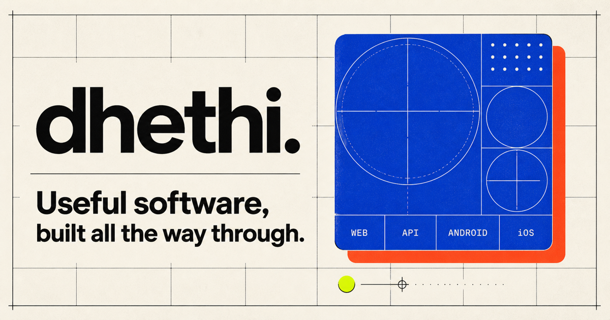

# Dhethi

> Useful software, built all the way through.

[](https://dhethi.com)
[](https://github.com/ThilakReddyy/dhethi_web)

**Website:** [https://dhethi.com](https://dhethi.com)



[Dhethi](https://dhethi.com) is an independent product brand that turns practical problems into dependable web, mobile, backend, and platform software. This repository contains Dhethi's official brand and product website.

## Built with

- React 18 and TypeScript
- Vite
- Tailwind CSS
- Radix UI and Lucide icons
- Vitest and Testing Library

## Local development

Install the dependencies and start the development server:

```bash
npm install
npm run dev
```

The site will be available at [http://localhost:8080](http://localhost:8080).

## Available commands

| Command | Purpose |
| --- | --- |
| `npm run dev` | Start the Vite development server |
| `npm run build` | Create a production build in `dist/` |
| `npm run build:dev` | Build using the development mode |
| `npm run preview` | Preview the production build locally |
| `npm run lint` | Run ESLint |
| `npm test` | Run the test suite once |
| `npm run test:watch` | Run tests in watch mode |

## Project structure

```text
public/                 Static assets and site metadata
scripts/                Production build helpers
src/components/         Layout, navigation, SEO, and UI components
src/pages/              Website pages
src/test/               Test setup and page tests
src/index.css           Global styles and Dhethi design system
play-console-assets/    Google Play developer-profile assets
```

## Links

- [Dhethi](https://dhethi.com)
